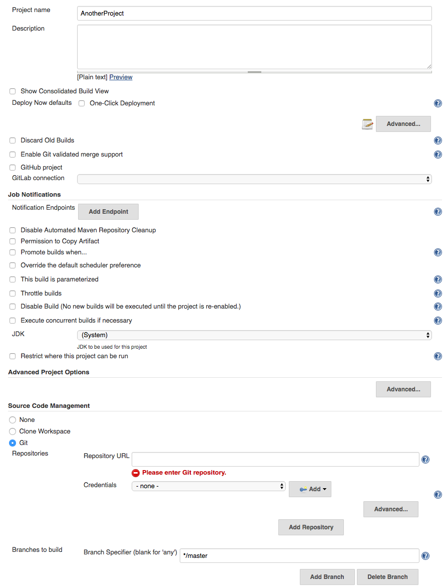
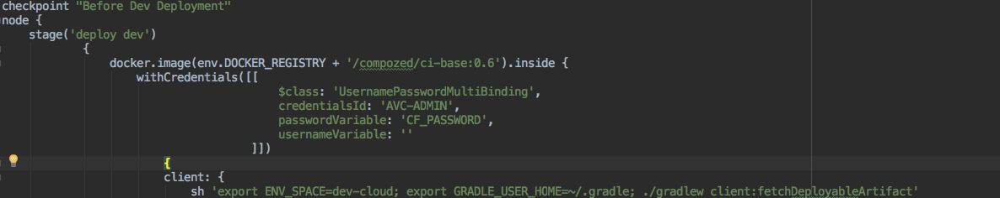
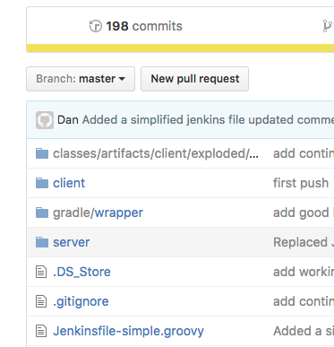
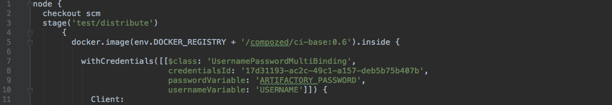
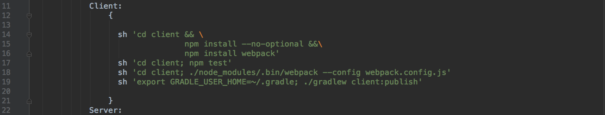
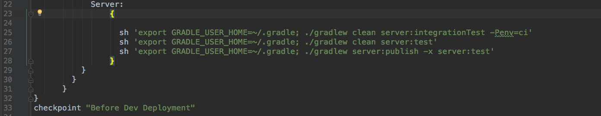

#HSLIDE
## Compozed Global Lunch and Learn
### Jenkinsfile

#HSLIDE
### Jenkins
  * Life before automating software deployment
  * Jenkins Definition:
    * Automation server which can be used to automate tasks such as building, testing, and deploying software
  * Benefits of Automated Software:
    * Deployments are less error-prone and more repeatable
    * Anyone on the team can deploy software
    * Devs spend time developing (instead of performing a time-consuming, thankless task)
    * More frequent releases 

#HSLIDE
### Jenkinsfile
  * Life before a Jenkinsfile:

#HSLIDE
### Jenkinsfile
  * A text file that contains the definition/steps of a Jenkins Pipeline and is checked into source control

  * Add to the root of the project

#HSLIDE
### Benefits of using a Jenkinsfile
 1. Easier to move to a new Jenkins instance
    * Which we will all have to do at the end of Q2 (~June)
 2. Version Control    
 3. Easier to see logic hidden behind each job
 4. Portability
    * Get up and running quickly when you move to a new team
 5. Supports more complexity (because it's groovy code)
    * Try/Catch blocks, functions, etc.

#HSLIDE
### Tips and Tricks
  1. Name your Jenkinsfile with the .groovy ending so IntelliJ highlights and assists you
  2. Let Gradle do the heavy lifting
    * Gradle has many plugins that allow tasks, such as adding your deployable artifact or pushing your app to Cloud Foundry, to be run simply by providing the config info to the plugin
    * Allows for a clean pipeline

  3. Use 'Pipeline Syntax' to help generate syntax for various tasks

#HSLIDE
### Let's get Started!!!
  1. Test stage
  2. Publish stage
  3. How to store credentials on Jenkins
  4. Deploy Dev
  5. Conveyor
  6. Manual Deploy to Production

#HSLIDE
### Test Stage - What Happens?
  1.
  2.
  3.
  4.
  5.
  

#HSLIDE
### Test Stage

#HSLIDE
### Test Stage

#HSLIDE
### Test Stage

#HSLIDE
### Publish Stage

#HSLIDE
### Storing Credentials on Jenkins

#HSLIDE
### Deploying to Dev

#HSLIDE
### Conveyor
#### What is it, how does it work, and what are the benefits?

#HSLIDE
### Setting up a manual deployment to Production

#HSLIDE
### fin.
